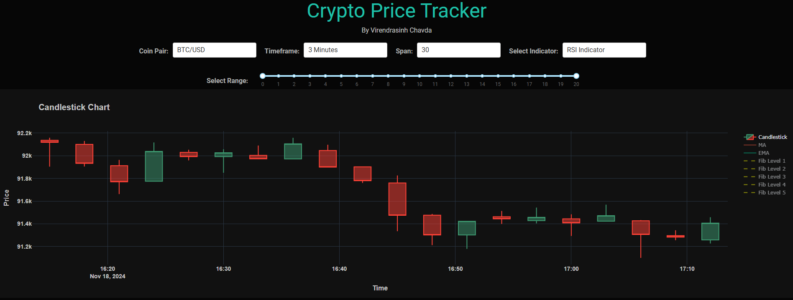

# Crypto Price Tracker [Click Here](https://crypto-tracker-live.nw.r.appspot.com/)
### Author: Virendrasinh Chavda

This repository contains the code for a real-time cryptocurrency tracking web app developed using Dash and Plotly. The app displays live candlestick charts, technical indicators like RSI and MACD, and a heatmap for visualizing price changes across various cryptocurrency pairs. Users can select the desired cryptocurrency, time frame, data span, and technical indicator to analyze market trends and make informed trading decisions. The app deployed on GCP.

## Table of Contents
1. [Overview](#Overview)
2. [Features](#Features)
3. [Usage](#Usage)
4. [Future Work](#Future-Work)
5. [Contributing](#Contributing)
6. [License](#License)

## Overview

The Crypto Price Tracker is a web application that offers real-time analysis of cryptocurrency prices. It provides a comprehensive view of price movement with interactive candlestick charts, various technical indicators (RSI, MACD, Bollinger Bands, Support and Resistance Levels), and a heatmap to visualize price changes across selected cryptocurrency pairs.

## Features:

* **Candlestick Chart**: Displays price movements with candlestick patterns, along with Moving Averages (MA) and Exponential Moving Averages (EMA).
* **Technical Indicators**: Includes Relative Strength Index (RSI), MACD, Bollinger Bands, and Support/Resistance levels.
* **Crypto Price Heatmap:**: Shows the latest percentage price changes across multiple cryptocurrencies in a heatmap format.
* **Dynamic Control Options**: Allows users to select coin pairs, timeframes, data span, and technical indicators for personalized analysis.
* **Real-Time Updates**: Data refreshes every 10 seconds to keep charts up-to-date with current market trends.

## Usage:

* **Select Coin Pair**: Choose a cryptocurrency pair (e.g., BTC/USD, ETH/USD) for analysis.
* **Set Timeframe**: Define the candlestick interval (e.g., 1 Minute, 3 Minutes, 1 Hour, 1 Day).
* **Adjust Span**: Choose the number of bars to display in the chart.
* **Choose Indicator**: Select a technical indicator like RSI, MACD, Bollinger Bands, or Support and Resistance levels.
* **Observe Heatmap**: The heatmap at the bottom shows the latest price movement trends across other cryptocurrencies.

The app will automatically refresh data every 10 seconds, providing updated charts and analysis.

## Future Work:

* Adding more technical indicators like VWAP and Stochastic Oscillator.
* Historical data analysis to observe past trends and predict future movements.
* User authentication to save preferences and create personalized dashboards.
* Integration with more APIs to access broader market data beyond Bitstamp.

## Contributing

Contributions are welcome! If you would like to suggest improvements, report issues, or contribute to the project, feel free to open a pull request or submit an issue.

## License

This project is licensed under the MIT License. See the [LICENSE](LICENSE) file for more details.

---

For more details, please refer to the source code in this repository.
